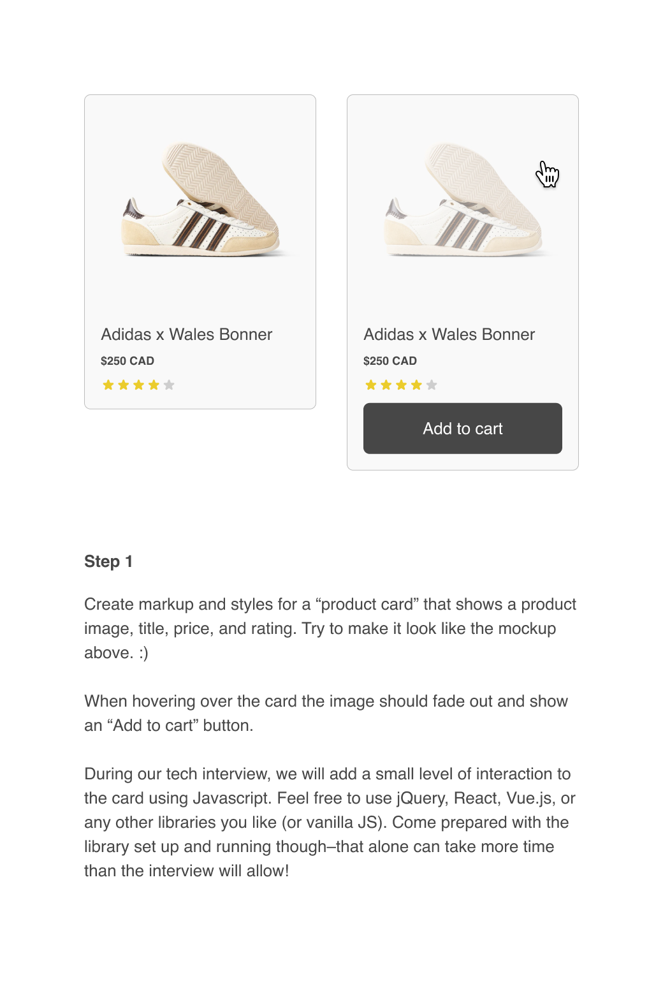

# Product Card

Welcome to the fancy Pixel Union Frontend Tech Interview!

The goal of these tech interviews is to get a feel for how you approach
development, providing a platform to talk through common, day-to-day
challenges and the technologies we use to solve them.

This is a highly-practical exercise. To prepare, we're asking that you build a
small web component, a product "card", using HTML/CSS/JS. Then, during the
interview we'll ask you to extend that with a few new features, talking through
your thought process. You are totally free to use any resources at your
disposal—search the web, look up something in a book, even ask me questions. Use
the tools you are comfortable with. No programming on whiteboards or balancing
binary trees :)

## Step 1

## Step 2

???

## Step 3

???
